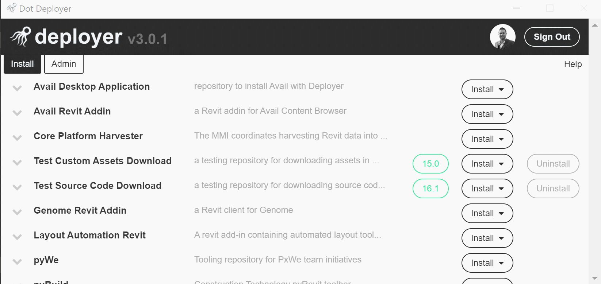

# Developer Documentation

**#1** - Add Your Repository to Your Team's **GitHub Application**

- *navigate to https://github.com/organizations/[TEAM-NAME]/settings/installations/[INSTALLATION-ID] to add your repository to your team's GitHub Application*

- *for example, WeWork's url is: https://github.com/organizations/WeConnect/settings/installations/543395*

**#2** - Add A **.deployer file** To Your Repository

- *a `.deployer` file is a JSON configuration file that tells DotDeployer how to install your repository*
- *see [the available schemas here](../schemas/README.md).     **The latest client supports only version 3.0.0***
- *[See examples of .deployer files on version 3.0.0](../schemas/examples.md)*

**#3** - Create A **Release** in Your Repository
- *DotDeployer uses GitHub releases to access the different versions of your repository / tool.  **If you are uploading custom assets to your release** (i.e. an .exe installer) **you must also include your .deployer file in the release!***

**#4** - Test Installing / Uninstalling Your Tool
- *DotDeployer allows you to set visibility permissions to specific users or user groups*
- *To test a release of your tool, set yourself as the only user with permission to install / uninstall the tool*

**#5** - Release to Users
- *to release to users (or specific user groups), change the permission settings again (the default user role is "user").  Remember, **pre-releases become available to users but are not auto installed**.*
