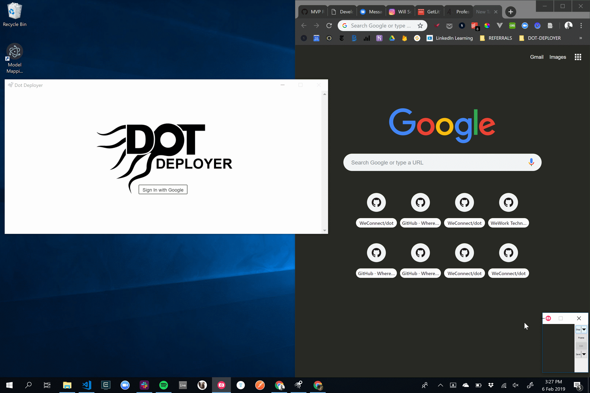
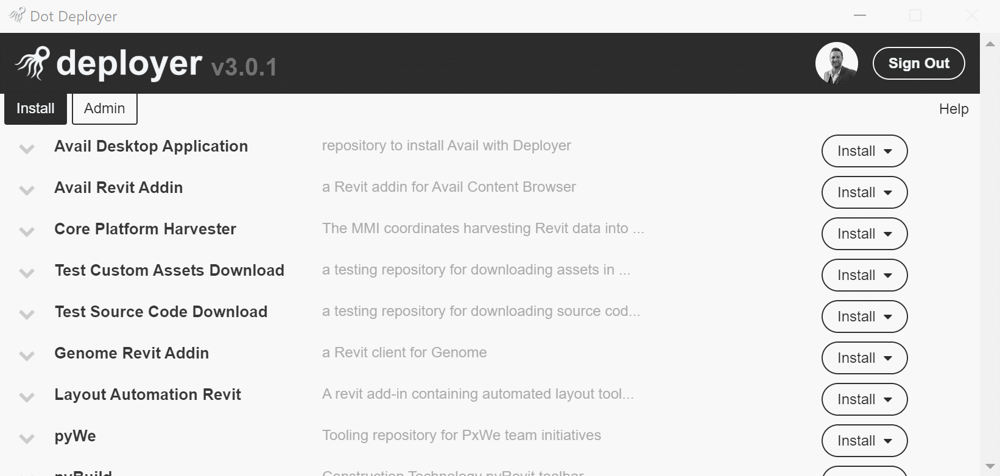
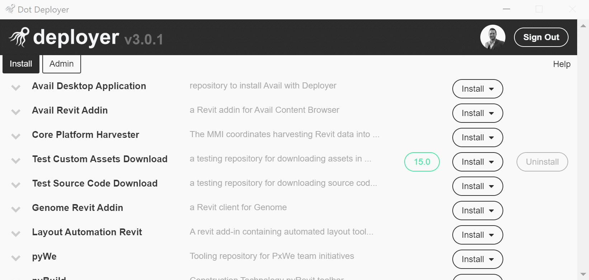

# User Documentation
**#1** - Install the Application
- *your team should provide a link to the installer*

**#2** - Log In with Google Credentials
- *click **Sign In With Google** to launch a login window*
- *log in to your respective Google account*

**#3** - Install a Tool

**#4** - Uninstall a Tool

**Note:**
- *tools will automatically update when new releases are available!*
