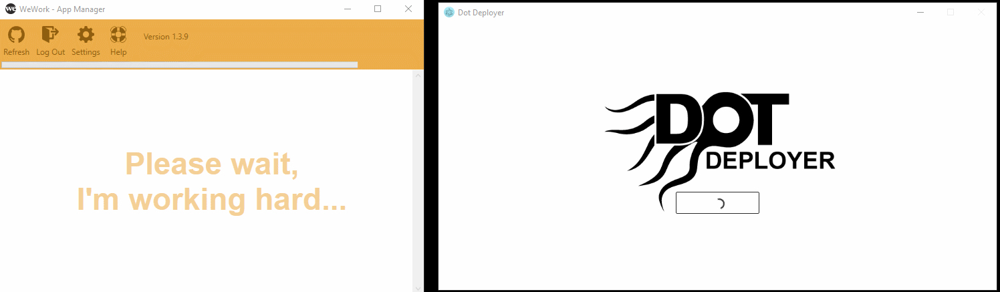
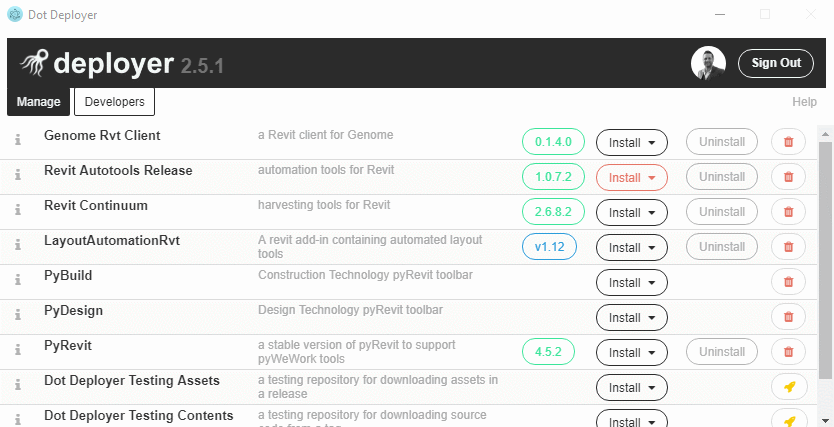
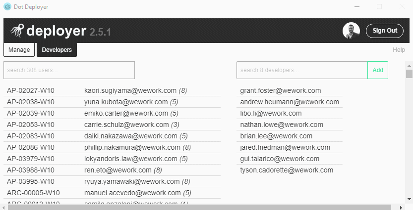

### Improvements to App Man Uninstall
*Deployer will uninstall App Man even if it is currently running...*

### Available Updates Visible in UI
*Install button will highlight orange when updates are available*

*Updates are normally **automatically installed**, unless:*
1. The update is a prerelease
2. A program was running when the update attempted to install
3. The tool is set to not autoupdate

### Improved Developer Panel
*Developers can search users and browse installs*

