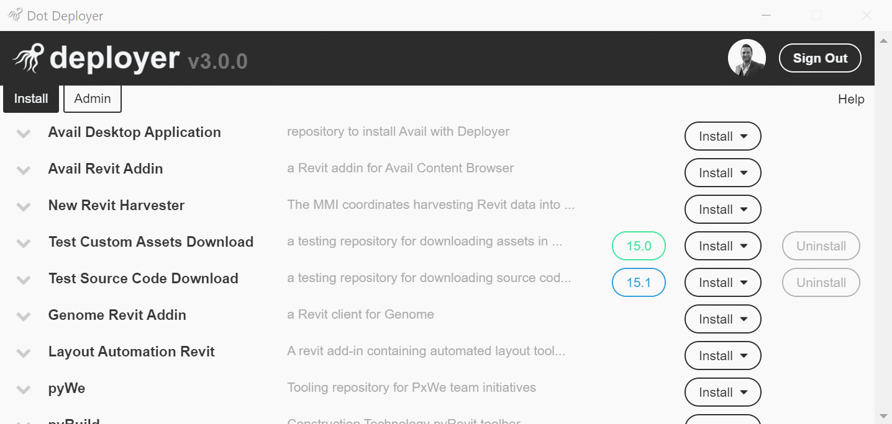

## 1.  New User Interface
*Dot Deployer has been re-skinned with an intuitive, expandble table interface*

## 2.  Release Tools to Specific Users or Groups
*Admins can now add / delete user permissions to specific tools*

## 3.  Edit Tool Name
*Admins can now edit the name of each tool*

## 4.  User Roles
*Admins can now edit each users role*

